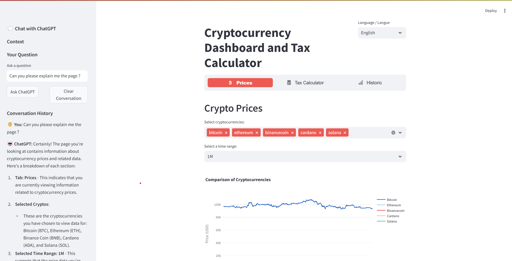

# Cryptocurrency Dashboard and Tax Calculator

## Description

This project is a Streamlit-based web application for tracking cryptocurrency prices, calculating taxes on cryptocurrency transactions, and exploring historic data. It also includes an integrated chatbot for assistance.

- **Monitor Cryptocurrency Prices**: Visualize real-time and historical data for multiple cryptocurrencies.
- **Calculate Taxes on Crypto Trades**: Calculate gains, losses, and applicable taxes on crypto transactions.
- **Analyze Historical Data**: View and analyze historical price trends for cryptocurrencies.
- **Chatbot Integration**: Interact with an integrated chatbot for assistance.

## Features

- **Multi-language Support**: English and French.
- **Custom Visualizations**: Compare cryptocurrency prices using dynamic and interactive charts.
- **Cryptocurrency Tax Calculator**: Input transaction details to compute gains, losses, and tax liabilities.
- **Integrated Chatbot**: Get answers to your questions directly within the application.



## Installation

### Prerequisites
- Python 3.9 or higher
- API keys for:
  - [CoinGecko API](https://www.coingecko.com/en/api)
  - [OpenAI API](https://openai.com/api/)

### Clone the Repository

```bash
$ git clone <repository_url>
$ cd <repository_folder>
```

### Install Dependencies

Create and activate a virtual environment (optional but recommended):

```bash
$ python -m venv venv
$ source venv/bin/activate # On Windows: venv\Scripts\activate
```

Install the required packages:

```bash
$ pip install -r requirements.txt
```

### Configure Secrets

Create a `.streamlit/secrets.toml` file and add your API keys:

```toml
COINGECKO_API_KEY = "your_coingecko_api_key"
OPENAI_API_KEY = "your_openai_api_key"
```

## Usage

Run the application locally:

```bash
$ streamlit run main.py
```

### Navigate the Application

1. **Prices Tab**: Monitor real-time prices and blockchain data.
2. **Tax Calculator Tab**: Calculate cryptocurrency trade taxes.
3. **Historic Tab**: Analyze historical cryptocurrency price data.

### Language Selection

Choose between English and French from the dropdown menu in the top-right corner.

## File Structure

```plaintext
project-folder/
├── main.py                # Main Streamlit app
├── utils/                 # Utility modules
│   ├── api.py            # API calls and data fetching
│   ├── calculations.py   # Tax calculation logic
│   ├── chatbot.py        # Chatbot functionality
│   ├── translations.py   # Language translations
│   └── visualization.py  # Visualization utilities
├── images/                # Images for README and app
│   └── dashboard.png     # Screenshot of the dashboard
├── requirements.txt       # Dependencies
└── .streamlit/            # Streamlit configuration files
    └── secrets.toml       # API keys (not included in the repo)
```

## Development Notes

- **Data Caching**: Utilizes `st.cache_data` for efficient API calls and improved performance.
- **Secrets Management**: All sensitive data like API keys are stored in `.streamlit/secrets.toml`.
- **Extensibility**: Add more features, languages, or integrations as needed.

## Requirements

The application depends on the following Python libraries:

- `plotly`
- `streamlit`
- `streamlit-option-menu`
- `openai`